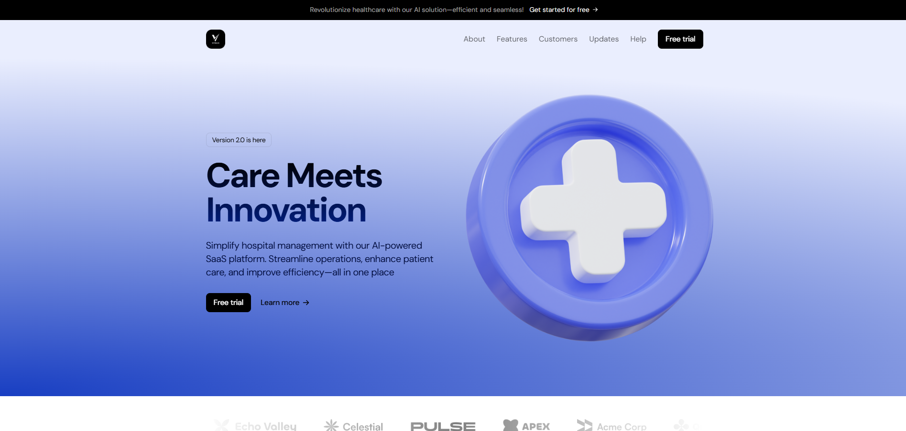
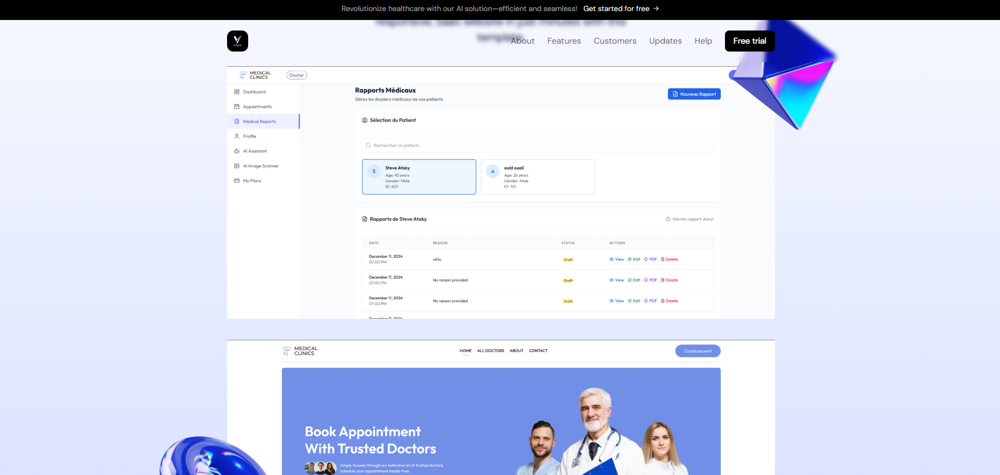
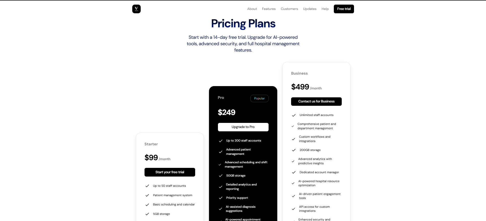

# VITALIS - Healthcare SaaS Landing Page


## Overview

VITALIS is a modern AI-powered SaaS platform designed specifically for healthcare institutions and hospitals. The platform offers comprehensive tools for patient management, scheduling, resource optimization, and administrative operations, all enhanced with artificial intelligence to improve efficiency and patient care.

## Features

- **AI-Powered Hospital Management**: Streamline operations with intelligent automation
- **Patient Management System**: Centralized patient records and care tracking
- **Advanced Scheduling**: Optimize appointment scheduling and staff allocation
- **Resource Management**: Efficiently track and manage hospital resources
- **Secure Data Storage**: HIPAA-compliant secure storage for patient records
- **Analytics Dashboard**: Gain insights with detailed reports and predictive analytics
- **Multi-tier Subscription Plans**: Flexible pricing options for institutions of all sizes

## Screenshots





## Technology Stack

- **Frontend**: Next.js 14, React 18, TypeScript
- **Styling**: Tailwind CSS, Framer Motion for animations
- **Forms**: React Hook Form for form validation
- **Payment Processing**: Stripe API integration
- **HTTP Client**: Axios for API requests

## Getting Started

### Prerequisites

- Node.js 18.x or higher
- npm or yarn package manager

### Installation

1. Clone the repository:
   ```bash
   git clone https://github.com/ITNKOC/landing-Page-Medical-saas.git
   cd landing-Page-Medical-saas
   ```

2. Install dependencies:
   ```bash
   npm install
   # or
   yarn install
   ```

3. Set up environment variables:
   Create a `.env.local` file in the root directory with the following variables:
   ```
   NEXT_PUBLIC_STRIPE_PUBLIC_KEY=your_stripe_public_key
   NEXT_PUBLIC_API_URL=your_backend_api_url
   ```

4. Run the development server:
   ```bash
   npm run dev
   # or
   yarn dev
   ```

5. Open [http://localhost:3000](http://localhost:3000) in your browser to see the application.

## Build for Production

```bash
npm run build
# or
yarn build
```

To start the production server:
```bash
npm run start
# or
yarn start
```

## Project Structure

```
src/
├── app/              # Next.js app router
├── assets/           # Images and SVG files
├── components/       # Reusable React components
├── pages/            # Additional page components
├── sections/         # Page sections (Header, Hero, etc.)
└── styles/           # Global styles
```

## Subscription Plans

VITALIS offers three subscription tiers:

1. **Starter Plan** - $99/month
   - Up to 50 staff accounts
   - Basic patient management
   - Standard support
   - 5GB storage

2. **Pro Plan** - $249/month
   - Up to 200 staff accounts
   - Advanced patient management
   - AI-assisted diagnosis suggestions
   - Priority support
   - 50GB storage

3. **Business Plan** - $499/month
   - Unlimited staff accounts
   - Comprehensive management tools
   - AI-powered resource optimization
   - 24/7 dedicated support
   - 200GB storage

## Backend Integration

The frontend is designed to connect with a RESTful API backend. The payment processing flow requires:

1. A backend endpoint at `http://localhost:4000/api/payment/create-checkout-session` for creating Stripe sessions
2. A backend endpoint at `http://localhost:4000/api/payment/check-session` for verifying payment status
3. A backend endpoint at `http://localhost:4000/api/payment/create-hospital` for registering new institutions

## Contributing

1. Fork the repository
2. Create your feature branch (`git checkout -b feature/amazing-feature`)
3. Commit your changes (`git commit -m 'Add some amazing feature'`)
4. Push to the branch (`git push origin feature/amazing-feature`)
5. Open a Pull Request

## License

This project is licensed under the MIT License - see the LICENSE file for details.

## Contact

For any questions or support regarding the implementation, please contact [koceila.djaballah@gmail.com](mailto:koceila.djaballah@gmail.com).

---

© 2024 VITALIS, Inc. All rights reserved.
